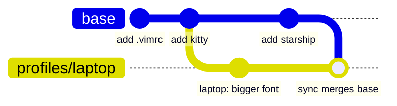
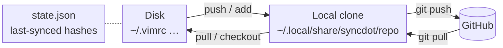
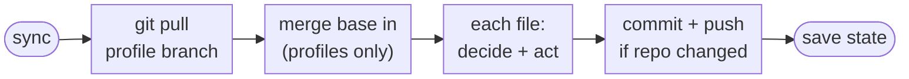
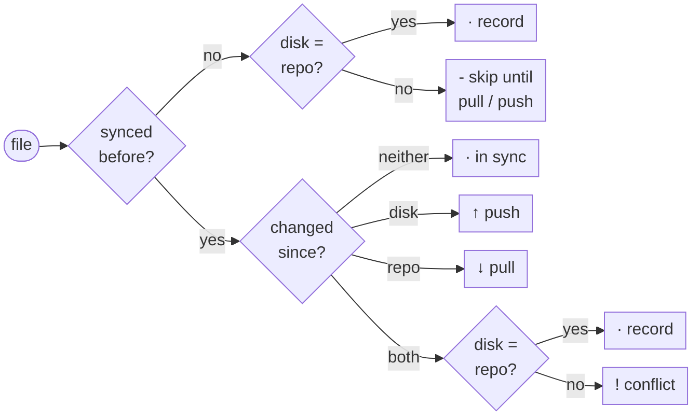

# syncdot
Author's Note:
I wanted to play a bit with Claude and see what it could do. Thought of building something that I could use on a daily basis. I've been a fan of chezmoi for a while but remembering the sync model and the syntax every time that I just wanted to backup or pull a file made me abandon it long ago.

I built this with Claude code using these self imposed rules:
* I decide on syntax.
* I decide on the logic.
* Python is the language of choice.
* No handling of secrets or binary files.
* Keep it as simple as possible.

Let me know if you like it.
##

Bidirectional dotfile sync backed by a git repo, with per-machine profiles
(git branches) and Jinja2 templating.

Edit a dotfile on any machine and `syncdot sync` pushes it to your dotfiles
repo; edit it in the repo (or on another machine) and the next sync pulls it
down. syncdot remembers what it last wrote to each file, so it can tell
which side changed and only asks a conflict policy to decide when both did.

## Contents

- [Install](#install)
- [Quick start](#quick-start)
- [Commands](#commands)
- [Automatic sync](#automatic-sync)
- [Dotfiles repo layout](#dotfiles-repo-layout)
- [Profiles](#profiles)
- [Templates](#templates)
- [Environment variables](#environment-variables)
- [Conflicts](#conflicts)
- [Configuration](#configuration)
- [What is not synced](#what-is-not-synced)
- [Development](#development)
- [Changelog](#changelog)
- [License](#license)
- [How it works](#how-it-works)

## Install

**Requirements:** Python 3.11+, [pipx](https://pipx.pypa.io/), git, and an
SSH key on your GitHub account for pushing to your dotfiles repo
(`ssh -T git@github.com` should greet you).
The optional auto-sync service needs systemd.

### 1. Install the tool

```sh
pipx install git+https://github.com/denomolo/syncdot.git@v0.9.0
syncdot --version
```

To upgrade later, run the same command with `--force` and the new tag. From
1.0.0 on, syncdot is on PyPI: `pipx install syncdot`, then `pipx upgrade
syncdot`. To install from a local checkout instead: `pipx install --force .`

**Coming from dotsync?** syncdot was called dotsync up to 0.8.0. Install
syncdot, run any `syncdot` command, and your config, clone and state move
to syncdot's locations automatically (`~/.config/syncdot`,
`~/.local/share/syncdot`, `~/.local/state/syncdot`); then
`pipx uninstall dotsync`. If you used the login service, run
`syncdot service install` once to replace it.

### 2. Create your dotfiles repo

Your dotfiles live in **your own** repo, separate from this one. Create a
new private repo on GitHub (e.g. `<you>/dotfiles`) and leave it **completely
empty** — no README, license or .gitignore — because syncdot creates the
first commit itself.

### 3. Set up syncdot

On every machine, the first one included:

```sh
syncdot init <you>/dotfiles
```

The repo can be `owner/repo`, an HTTPS GitHub URL (both converted to SSH so
your key is used) or any git URL. An empty repo is set up as a new syncdot
repo; an existing one is cloned. If you haven't created the GitHub repo
yet, `syncdot init <you>/dotfiles --new` starts one locally and pushes it
on your first `syncdot add`.

`init` writes `~/.config/syncdot/config.yaml` and the clone, and asks
whether to sync automatically at login (off unless you say yes; see
[Automatic sync](#automatic-sync)). It never touches the files in your home
directory. Use `--profile <name>` to start on a profile other than `base`.
(Before 0.8.0 this was `install --repo-url …`, which still works.)

## Quick start

```sh
# Start tracking files (one commit, pushed to GitHub)
syncdot add ~/.vimrc ~/.bashrc ~/.config/kitty

# See what changed
syncdot status

# Sync both ways
syncdot sync
```

On another machine, after `syncdot init`, nothing is synced until you
say so. `sync` only handles files that were already synced on that
machine; everything else is listed by `status` and left alone:

```sh
syncdot status                       # what's in the repo, and what differs here
syncdot pull                         # take the repo's version of everything (asks before
                                     # overwriting anything that differs here)
syncdot pull ~/.config/kitty         # ...or just some files
syncdot push ~/.bashrc               # keep this machine's version instead
```

After a file has been pulled or pushed once on a machine, `sync` keeps it
in step from then on. The same goes for files that another machine adds to
the repo later: `sync` reports them until you `pull` them.

## Commands

| Command | What it does |
| --- | --- |
| `syncdot init REPO [--new]` | Set syncdot up on this machine: clone (or start) your dotfiles repo and write the config. |
| `syncdot sync` | Two-way sync of every tracked file (see [How it works](#how-it-works)). |
| `syncdot status [PATH...] [--diff]` | Show what `sync` would do for each file (or just `PATH`s), including changes waiting on GitHub, without changing anything; `--diff` shows how files differ. |
| `syncdot push [PATH...]` | Copy this machine's version to the repo, for every file or just `PATH`s. Commits and pushes. |
| `syncdot pull [PATH...] [--yes]` | Copy the repo's version to this machine, for every file or just `PATH`s; asks before overwriting local changes. |
| `syncdot add PATH... [--remote R] [--allow-private]` | Start tracking files or directories from disk. |
| `syncdot checkout REMOTE... [--local L] [--force]` | Start tracking files that are already in the repo, writing them to disk. |
| `syncdot remove PATH...` | Stop tracking files or directories. The copies on disk are kept. |
| `syncdot var list \| set NAME=VALUE... \| unset NAME...` | Manage [template variables](#variables). |
| `syncdot env list \| set NAME=VALUE... \| unset NAME... \| hook` | Manage [environment variables](#environment-variables) for your session. |
| `syncdot profile list \| set NAME \| new NAME` | Manage [profiles](#profiles). |
| `syncdot service install \| uninstall \| status` | Opt in to syncing automatically at login ([details](#automatic-sync)). |
| `syncdot --version` | Print the installed version. |

`sync`, `push`, `pull`, `add`, `checkout`, `remove`, `var set|unset` and
`env set|unset` accept `--dry-run` to show what would happen without
changing anything: incoming changes from GitHub are fetched and previewed
(including merging `base` into a profile) in a temporary copy, so your
files, the local clone's branches and its working tree stay exactly as
they were. `sync`, `push` and `pull` accept `-v` to list unchanged files
too.

Only one syncdot runs at a time. If you start a command while another one
is running (for example the background `sync`), it waits for it to
finish, and gives up after two minutes.

### Output symbols

| Symbol | Meaning |
| --- | --- |
| `↑` | disk → repo (pushed) |
| `↓` | repo → disk (pulled) |
| `!` | conflict, resolved by the configured policy (shown in brackets) |
| `−` | no longer tracked |
| `·` | already in sync |
| `-` | skipped (e.g. binary file) |

### `add`

```sh
syncdot add ~/.vimrc ~/.config/environment.d
syncdot add ~/.config/foo/*.conf
syncdot add '~/.config/foo/*.conf'          # quoted: syncdot expands it
syncdot add /etc/hosts --remote system/      # outside ~ needs --remote
```

- Each path is stored under `files/` at its location relative to your home
  directory: `~/.config/environment.d` → `files/.config/environment.d`.
- `--remote R` picks the location under `files/` instead. If `R` ends with
  `/`, is an existing directory, or several paths are given, each path keeps
  its name inside `R`.
- Everything is added in one commit. Paths that can't be added (missing,
  already tracked, binary, private, a symlink, or two paths that would land
  on the same repo path) are reported, the rest are still added, and the
  command exits with status 1.
- Private files are refused: a file only you can access (no group or other
  permissions, e.g. mode `600`), a directory like that (e.g. `~/.ssh` at
  `700`), or a directory containing such a file. They usually hold secrets,
  and their contents would end up in your dotfiles repo. Pass
  `--allow-private` to track them anyway.

### `checkout`

The reverse of `add`, for setting up a new machine from a populated repo.

```sh
syncdot checkout .vimrc                              # files/.vimrc → ~/.vimrc
syncdot checkout '.config/*'                         # glob, matched in the repo
syncdot checkout nvim --local ~/.config/nvim         # choose where it goes
syncdot checkout .bashrc --force                     # overwrite a different local file
```

- `REMOTE` paths are relative to `files/` (a leading `files/` is accepted).
- `--local` defaults to `~/<REMOTE>`, with any `.j2` suffix dropped.
- An existing local file with **the same** content is simply tracked. One
  with **different** content is left alone and reported, unless you pass
  `--force`.

### `status`

```sh
syncdot status                       # every tracked file
syncdot status ~/.vimrc              # just one (or several, or a quoted glob)
syncdot status ~/.config/kitty --diff
```

`--diff` prints a unified diff for each file that differs, from the repo's
version (rendered, for templates) to this machine's: `-` lines are only in
the repo, `+` lines only here. Directories are compared file by file, and
binary files are only reported as different.

`status` fetches from GitHub first, so it includes changes that `sync`
would pull (previewed in a temporary copy, like `--dry-run`; nothing is
merged). `--no-fetch` compares with the local clone only, and offline it
warns and does that anyway. For scripts, `--exit-code` exits with 3 when
anything isn't in sync and 0 when everything is.

### `push` and `pull`

```sh
syncdot push ~/.config/starship.toml
syncdot pull '~/.config/foo/*'      # also restores files deleted from disk
```

Without paths they act on every tracked file. Paths are files or
directories on disk as listed in the manifest; quoted globs are matched
against tracked paths rather than the filesystem. A file *inside* a tracked
directory is rejected — use the directory. `remove` takes paths the same
way.

`pull` never silently loses local work: if a file has changes that aren't
in the repo (edited since it was last synced, or a local file that was
never synced, like a distribution's default `.bashrc`), `pull` lists those
files and asks before overwriting them. Files that are simply out of date
are pulled without asking. `--yes` skips the question; in a script without
`--yes`, `pull` refuses and changes nothing.

### Exit codes

`0` success, `1` error (including any file a `sync`, `push` or `pull`
couldn't handle), `2` invalid command-line usage, and `3` from
`status --exit-code` when something isn't in sync.

## Automatic sync

Automatic sync is off unless you opt in, and then it only runs at login:

```sh
syncdot service install      # sync at every login, after the network is up
syncdot service status
syncdot service uninstall
```

This installs a systemd user unit, `~/.config/systemd/user/syncdot.service`,
that runs `syncdot sync` once per login; it doesn't run a sync right away.
Output goes to the journal: `journalctl --user -u syncdot`. Without systemd,
run `syncdot sync` from your shell's startup files instead. (syncdot 0.6.0
also installed an hourly `syncdot.timer`; `service install` and `uninstall`
remove it.)

## Dotfiles repo layout

Every branch of your dotfiles repo has the same layout:

```
files/           # the dotfiles themselves
  .vimrc
  .config/kitty/kitty.conf
  .gitconfig.j2  # rendered as a template
vars.yaml        # variables for templates
manifest.yaml    # which repo path goes where on disk
README.md
```

`manifest.yaml` maps each repo path (`source`) to its location on disk
(`dest`). `add`, `checkout` and `remove` maintain it for you, keeping any
comments, but you can edit it by hand:

```yaml
files:
  - source: files/.vimrc
    dest: ~/.vimrc

  - source: files/.config/kitty
    dest: ~/.config/kitty
```

See [`manifest.yaml.example`](manifest.yaml.example) and
[`vars.yaml.example`](vars.yaml.example).

## Profiles

A profile is a git branch. `base` holds what every machine shares; each
other profile is a `profiles/<name>` branch that starts as a copy of `base`
and adds its own commits on top.



```sh
syncdot profile new laptop     # create profiles/laptop from base
syncdot profile set laptop     # make it this machine's active profile
syncdot pull                   # apply it to disk
syncdot profile list           # base, laptop ← active
```

- To change a file or variable for one profile, edit it on that profile's
  branch: anything you push while the profile is active is committed there.
- Every `sync` (and `pull`/`checkout`) merges `base` into the active profile
  branch, so shared changes reach every profile.
- If the merge conflicts (both `base` and the profile changed the same
  lines), syncdot aborts it, warns you with the `git merge` command to run
  in the repo clone, and leaves the branch and your files untouched until
  you resolve it.

## Templates

Files ending in `.j2` are rendered with [Jinja2](https://jinja.palletsprojects.com/)
using the variables in `vars.yaml` before being written to disk. Undefined
variables are an error rather than silently empty.

```yaml
# vars.yaml
email: you@example.com
editor: nvim
```

```ini
# files/.gitconfig.j2
[user]
    email = {{ email }}
[core]
    editor = {{ editor }}
```

Directories are always copied verbatim, never rendered.

### Variables

Manage `vars.yaml` with `syncdot var` instead of editing it in the repo:

```sh
syncdot var set fullname="Ariel Shatil" email=ariel@example.com
syncdot var list
syncdot var unset editor
```

- `set` and `unset` change `vars.yaml` on the **active profile's branch**,
  re-render the templates on disk, and commit and push, so other machines
  get the change on their next sync. Comments in `vars.yaml` are kept.
- Values are stored as strings: `port=22` and `debug=true` stay `"22"` and
  `"true"`. Add `--yaml` to parse values as YAML instead, for numbers,
  booleans or lists (`--yaml retries=3 hosts="[a, b]"`).
- `unset` refuses a variable that a tracked template still uses, since the
  template could no longer render; `--force` unsets it anyway.
- Both take `--dry-run`. Names are letters, digits and `_`, not starting
  with a digit.
- On a profile, `set` overrides the `base` value for that profile only, and
  later changes to `base` still merge in. `unset` on a profile removes the
  variable for that profile; it doesn't fall back to `base`'s value.

Templated files only flow **repo → disk**. If you edit the rendered file on
disk (e.g. `~/.gitconfig`), `sync` and `push` report an error instead of
copying it over the template, and leave both sides alone. Make the change in
the `.j2` file in the repo, or run `syncdot pull <path>` to discard the
local edit. See
[`dot_gitconfig.j2.example`](dot_gitconfig.j2.example).

## Environment variables

`syncdot env` manages environment variables for your session, such as
`EDITOR` or `GIT_AUTHOR_EMAIL`. They live in their own `env:` section of
`vars.yaml`, separate from template variables, so only what you list there
is exported:

```sh
syncdot env set EDITOR=nvim BROWSER=firefox
syncdot env set GIT_AUTHOR_EMAIL='{{ email }}'   # reuse a template variable
syncdot env list
syncdot env unset BROWSER
```

```yaml
# vars.yaml
email: ariel@example.com
env:
  EDITOR: nvim
  GIT_AUTHOR_EMAIL: '{{ email }}'
```

On every `sync`, `pull`, `checkout` and `var`/`env` change, syncdot writes
them to **`~/.config/environment.d/99-env.conf`**, one `KEY="value"` per
line, a format both systemd and POSIX shells read:

- **systemd user session:** reads the file by itself, so user services and
  the graphical session on desktops started through systemd (e.g. GNOME,
  KDE Plasma) get the variables. syncdot also updates the running session,
  so newly started services see changes straight away.
- **Shells** (TTYs, SSH, systems without systemd): add the line printed by
  `syncdot env hook` to `~/.profile`, and to `~/.bashrc` / `~/.zshrc` to
  have it in every interactive shell:

```sh
[ -r ~/.config/environment.d/99-env.conf ] && { set -a; . ~/.config/environment.d/99-env.conf; set +a; }
```

- Values may use template variables (`'{{ email }}'`); quote them with
  single quotes so your shell leaves the braces alone. `var unset` refuses
  a template variable that an env value still uses.
- Values can't contain newlines or `$` (systemd would expand it), so
  `PATH`-style expansion isn't supported. Variables your session manages
  (`PATH`, `HOME`, `USER`, `SHELL`, `DISPLAY`, `XDG_RUNTIME_DIR`, `LD_*`
  and similar) are refused.
- systemd applies `environment.d` files in name order, later ones winning.
  Many distributions link `/etc/environment` in as `99-environment.conf`,
  which sorts *after* `99-env.conf`, so for any name set in both (often
  `EDITOR`, `VISUAL`) the systemd session uses `/etc/environment`'s value
  from the next login on. Until then, the running session has syncdot's
  value, since syncdot pushes changes into it directly. Shells that source
  the hook always get syncdot's value.
- `99-env.conf` belongs to syncdot: don't edit it, and if you track
  `~/.config/environment.d` itself, syncdot leaves this file out of the
  repo.
- Like everything in `vars.yaml`, env variables are per profile.
- Shells that are already open keep their old environment; open a new one
  (or re-run the hook line) to pick up changes. Graphical sessions pick up
  `environment.d` changes at the next login.

## Conflicts

A conflict means a file changed both on disk and in the repo since it was
last synced on this machine. (A file that was never synced on this machine
isn't a conflict: `sync` leaves it alone until you `pull` or `push` it.)
`conflict_resolution` in the config decides what happens:

| Mode | Behaviour |
| --- | --- |
| `local-wins` (default) | This machine's version wins and is pushed. |
| `newer-wins` | The newer side wins: the file's modification time on disk vs the time of the last commit that changed it in the repo. |
| `repo-wins` | The repo's version wins and overwrites the local file. |

(Before 0.8.0 these were `machine-wins`, `last-write-wins` and `git-wins`;
the old names still work.)

`local-wins` is the default because it never loses anything: the repo's
version it replaces stays in git history, while a local file that gets
overwritten is gone. The sync output shows where to find it:

```
!  ~/.vimrc  [local-wins; repo version kept in history at 3f2c1ab]
```
```sh
git -C ~/.local/share/syncdot/repo show 3f2c1ab:files/.vimrc   # view it
syncdot push ~/.vimrc                                           # after restoring the file
```

`syncdot push` and `syncdot pull` are one-off overrides equivalent to
`local-wins` and `repo-wins` (and `pull` asks before overwriting local
changes).

## Configuration

`~/.config/syncdot/config.yaml` (override the location with the
`SYNCDOT_CONFIG` environment variable):

```yaml
profile: base                          # active profile
conflict_resolution: local-wins        # or newer-wins / repo-wins
auto_push: true                        # push to GitHub after each commit
include_binary: false                  # sync binary files too
repo_path: ~/.local/share/syncdot/repo
state_path: ~/.local/state/syncdot/state.json
```

## What is not synced

- **Binary files** (a NUL byte in the first 8 KB) are skipped unless
  `include_binary: true`.
- **Symlinks** are never tracked or followed; inside a tracked directory
  they are left untouched on both sides.
- **Nested `.git` directories** inside a tracked directory are ignored, so
  they don't turn into submodules.
- **Private files** (e.g. mode `600`) are refused by `add` unless you pass
  `--allow-private`.
- **Permissions**, apart from the executable bit: git records only whether
  a file is executable, so pulled files get your default permissions
  (usually `644`, or `755` for executables). A file tracked with
  `--allow-private` is therefore *not* kept at `600` on other machines. A
  change to the executable bit alone, with no content change, isn't synced.

## Development

```sh
python -m venv .venv
.venv/bin/pip install -e '.[dev]'
.venv/bin/pytest
```

Each test runs the real CLI in an isolated sandbox: a bare git repo standing
in for GitHub, a temporary home directory and config, and a fake
`systemctl` that only records its arguments. Tests never touch your real
files, dotfiles repo or systemd session. The suite runs on every push and
pull request (`.github/workflows/tests.yml`).

## Changelog

See [CHANGELOG.md](CHANGELOG.md). syncdot is pre-1.0: minor releases may
include breaking changes, which are always called out there.

## License

Copyright (c) 2026 Ariel Shatil. syncdot is released under the
[MIT License](LICENSE). (Versions up to 0.8.0 were released under the GPL
3.0 or later.)

## How it works

Three places are involved: your files on disk, a local clone of your
dotfiles repo, and GitHub. A machine-local state file records the hash of
what was last synced for each file, which is how syncdot tells which side
changed. Templates (`.j2`) are rendered on the way to disk.



### What `syncdot sync` does

On a profile other than `base`, sync first merges `base` into the
profile branch. It then decides each file as below, commits and pushes if
anything in the repo changed (plain pushes or conflicts the disk won), and
saves the state file.



### How each file is decided

For every tracked file syncdot computes three hashes: the file on disk, the
file in the repo (after rendering templates), and the one it recorded the
last time it synced that file.



*record*: nothing to copy, just remember the hash. *skip*: a file never
synced on this machine (missing here, or different) is left alone until you
`pull` or `push` it. *conflict*: settled by `conflict_resolution` (default
`local-wins`; see [Conflicts](#conflicts)).
