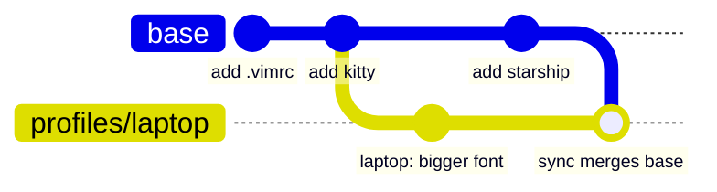
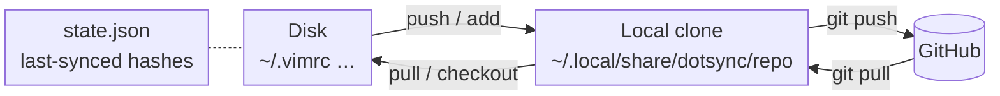
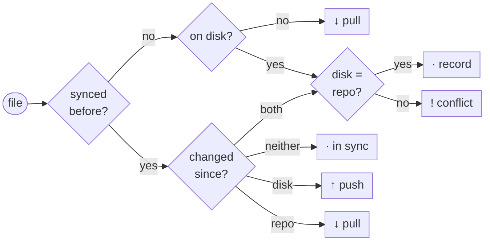

# dotsync

Bidirectional dotfile sync backed by a git repo, with per-machine profiles
(git branches) and Jinja2 templating.

Edit a dotfile on any machine and `dotsync sync` pushes it to your dotfiles
repo; edit it in the repo (or on another machine) and the next sync pulls it
down. dotsync remembers what it last wrote to each file, so it can tell
which side changed and only asks a conflict policy to decide when both did.

## Contents

- [Install](#install)
- [Quick start](#quick-start)
- [Commands](#commands)
- [Dotfiles repo layout](#dotfiles-repo-layout)
- [Profiles](#profiles)
- [Templates](#templates)
- [Conflicts](#conflicts)
- [Configuration](#configuration)
- [What is not synced](#what-is-not-synced)
- [Changelog](#changelog)
- [License](#license)
- [How it works](#how-it-works)

## Install

**Requirements:** Python 3.11+, [pipx](https://pipx.pypa.io/), git, and an
SSH key on your GitHub account (`ssh -T git@github.com` should greet you).
The optional auto-sync service needs systemd.

### 1. Install the tool

This repository is private, so you need collaborator access. Install a
tagged release straight from GitHub:

```sh
pipx install git+ssh://git@github.com/denomolo/dotsync.git@v0.4.3
dotsync --version
```

To upgrade later, run the same command with `--force` and the new tag. To
install from a local checkout instead: `pipx install --force .`

### 2. Create your dotfiles repo

Your dotfiles live in **your own** repo, separate from this one. Create a
new private repo on GitHub (e.g. `<you>/dotfiles`) and leave it **completely
empty** — no README, license or .gitignore — because dotsync creates the
first commit itself.

### 3. Set up dotsync

On your first machine, initialise the repo:

```sh
dotsync install --repo-url <you>/dotfiles --init
```

On every other machine, clone it instead (the default):

```sh
dotsync install --repo-url <you>/dotfiles
```

`--repo-url` accepts `owner/repo`, an HTTPS GitHub URL (both converted to
SSH so your key is used) or any git URL. `install` writes
`~/.config/dotsync/config.yaml`, and asks whether to install the systemd
user service that runs `dotsync sync` on every login. Use
`--profile <name>` to start on a profile other than `base`.

## Quick start

```sh
# Start tracking files (one commit, pushed to GitHub)
dotsync add ~/.vimrc ~/.bashrc ~/.config/kitty

# See what changed
dotsync status

# Sync both ways
dotsync sync

# On a new machine: bring files from the repo onto disk and track them
dotsync checkout .vimrc .config/kitty
dotsync checkout '*'                  # everything in the repo
```

## Commands

| Command | What it does |
| --- | --- |
| `dotsync install` | First-time setup: clone (or `--init`) your dotfiles repo, write the config, optionally install the systemd service. |
| `dotsync sync` | Two-way sync of every tracked file (see [How it works](#how-it-works)). |
| `dotsync status` | Show what `sync` would do for each file, without changing anything. |
| `dotsync push [PATH...]` | Force disk → repo, for every file or just `PATH`s. Commits and pushes. |
| `dotsync pull [PATH...]` | Force repo → disk, for every file or just `PATH`s. |
| `dotsync add PATH... [--remote R]` | Start tracking files or directories from disk. |
| `dotsync checkout REMOTE... [--local L] [--force]` | Start tracking files that are already in the repo, writing them to disk. |
| `dotsync remove PATH` | Stop tracking a file or directory. The copy on disk is kept. |
| `dotsync profile list \| set NAME \| new NAME` | Manage [profiles](#profiles). |
| `dotsync service install \| uninstall \| status` | Manage the systemd user service that syncs on login. |
| `dotsync --version` | Print the installed version. |

`sync`, `push`, `pull`, `add`, `checkout` and `remove` accept `--dry-run`
to show what would happen; `sync`, `push` and `pull` accept `-v` to list
unchanged files too.

### Output symbols

| Symbol | Meaning |
| --- | --- |
| `↑` | disk → repo (pushed) |
| `↓` | repo → disk (pulled) |
| `!` | conflict, resolved by the configured policy (shown in brackets) |
| `−` | no longer tracked |
| `·` | already in sync |
| `-` | skipped (e.g. binary file) |

### `add`

```sh
dotsync add ~/.vimrc ~/.config/environment.d
dotsync add ~/.config/foo/*.conf
dotsync add '~/.config/foo/*.conf'          # quoted: dotsync expands it
dotsync add /etc/hosts --remote system/      # outside ~ needs --remote
```

- Each path is stored under `files/` at its location relative to your home
  directory: `~/.config/environment.d` → `files/.config/environment.d`.
- `--remote R` picks the location under `files/` instead. If `R` ends with
  `/`, is an existing directory, or several paths are given, each path keeps
  its name inside `R`.
- Everything is added in one commit. Paths that can't be added (missing,
  already tracked, binary, a symlink, or two paths that would land on the
  same repo path) are reported, the rest are still added, and the command
  exits with status 1.

### `checkout`

The reverse of `add`, for setting up a new machine from a populated repo.

```sh
dotsync checkout .vimrc                              # files/.vimrc → ~/.vimrc
dotsync checkout '.config/*'                         # glob, matched in the repo
dotsync checkout nvim --local ~/.config/nvim         # choose where it goes
dotsync checkout .bashrc --force                     # overwrite a different local file
```

- `REMOTE` paths are relative to `files/` (a leading `files/` is accepted).
- `--local` defaults to `~/<REMOTE>`, with any `.j2` suffix dropped.
- An existing local file with **the same** content is simply tracked. One
  with **different** content is left alone and reported, unless you pass
  `--force`.

### `push` and `pull`

```sh
dotsync push ~/.config/starship.toml
dotsync pull '~/.config/foo/*'      # also restores files deleted from disk
```

Without paths they act on every tracked file. Paths are files or
directories on disk as listed in the manifest; quoted globs are matched
against tracked paths rather than the filesystem. A file *inside* a tracked
directory is rejected — use the directory.

## Dotfiles repo layout

Every branch of your dotfiles repo has the same layout:

```
files/           # the dotfiles themselves
  .vimrc
  .config/kitty/kitty.conf
  .gitconfig.j2  # rendered as a template
vars.yaml        # variables for templates
manifest.yaml    # which repo path goes where on disk
README.md
```

`manifest.yaml` maps each repo path (`source`) to its location on disk
(`dest`). `add`, `checkout` and `remove` maintain it for you, keeping any
comments, but you can edit it by hand:

```yaml
files:
  - source: files/.vimrc
    dest: ~/.vimrc

  - source: files/.config/kitty
    dest: ~/.config/kitty
```

See [`manifest.yaml.example`](manifest.yaml.example) and
[`vars.yaml.example`](vars.yaml.example).

## Profiles

A profile is a git branch. `base` holds what every machine shares; each
other profile is a `profiles/<name>` branch that starts as a copy of `base`
and adds its own commits on top.



```sh
dotsync profile new laptop     # create profiles/laptop from base
dotsync profile set laptop     # make it this machine's active profile
dotsync pull                   # apply it to disk
dotsync profile list           # base, laptop ← active
```

- To change a file or variable for one profile, edit it on that profile's
  branch: anything you push while the profile is active is committed there.
- Every `sync` (and `pull`/`checkout`) merges `base` into the active profile
  branch, so shared changes reach every profile.
- If the merge conflicts (both `base` and the profile changed the same
  lines), dotsync aborts it, warns you with the `git merge` command to run
  in the repo clone, and leaves the branch and your files untouched until
  you resolve it.

## Templates

Files ending in `.j2` are rendered with [Jinja2](https://jinja.palletsprojects.com/)
using the variables in `vars.yaml` before being written to disk. Undefined
variables are an error rather than silently empty.

```yaml
# vars.yaml
email: you@example.com
editor: nvim
```

```ini
# files/.gitconfig.j2
[user]
    email = {{ email }}
[core]
    editor = {{ editor }}
```

Profiles override variables by editing `vars.yaml` on their branch.
Directories are always copied verbatim, never rendered.

Templated files only flow **repo → disk**. If you edit the rendered file on
disk (e.g. `~/.gitconfig`), `sync` and `push` report an error instead of
copying it over the template, and leave both sides alone. Make the change in
the `.j2` file in the repo, or run `dotsync pull <path>` to discard the
local edit. See
[`dot_gitconfig.j2.example`](dot_gitconfig.j2.example).

## Conflicts

A conflict means a file changed both on disk and in the repo since the last
sync (or exists on both sides with different content the first time it is
synced). `conflict_resolution` in the config decides what happens:

| Mode | Behaviour |
| --- | --- |
| `last-write-wins` (default) | The newer side wins: the file's modification time on disk vs the time of the last commit that changed it in the repo. |
| `machine-wins` | Disk always wins (good for propagating one machine's setup). |
| `git-wins` | The repo always wins (good for recovering a messed-up machine). |

`dotsync push` and `dotsync pull` are one-off overrides equivalent to
`machine-wins` and `git-wins`.

## Configuration

`~/.config/dotsync/config.yaml` (override the location with the
`DOTSYNC_CONFIG` environment variable):

```yaml
repo_url: git@github.com:you/dotfiles.git
profile: base                          # active profile
conflict_resolution: last-write-wins   # or machine-wins / git-wins
auto_push: true                        # push to GitHub after each commit
include_binary: false                  # sync binary files too
repo_path: ~/.local/share/dotsync/repo
state_path: ~/.local/state/dotsync/state.json
```

## What is not synced

- **Binary files** (a NUL byte in the first 8 KB) are skipped unless
  `include_binary: true`.
- **Symlinks** are never tracked or followed; inside a tracked directory
  they are left untouched on both sides.
- **Nested `.git` directories** inside a tracked directory are ignored, so
  they don't turn into submodules.

## Changelog

See [CHANGELOG.md](CHANGELOG.md). dotsync is pre-1.0: minor releases may
include breaking changes, which are always called out there.

## License

Copyright (C) 2026 Ariel Shatil

dotsync is free software: you can redistribute it and/or modify it under
the terms of the GNU General Public License as published by the Free
Software Foundation, either version 3 of the License, or (at your option)
any later version. It is distributed in the hope that it will be useful,
but WITHOUT ANY WARRANTY; without even the implied warranty of
MERCHANTABILITY or FITNESS FOR A PARTICULAR PURPOSE. See [LICENSE](LICENSE)
for the full text.

## How it works

Three places are involved: your files on disk, a local clone of your
dotfiles repo, and GitHub. A machine-local state file records the hash of
what was last synced for each file, which is how dotsync tells which side
changed. Templates (`.j2`) are rendered on the way to disk.



### What `dotsync sync` does

On a profile other than `base`, sync first merges `base` into the
profile branch. It then decides each file as below, commits and pushes if
anything in the repo changed (plain pushes or conflicts the disk won), and
saves the state file.


### How each file is decided

For every tracked file dotsync computes three hashes: the file on disk, the
file in the repo (after rendering templates), and the one it recorded the
last time it synced that file.



*record*: nothing to copy, just remember the hash. *conflict*: settled by
`conflict_resolution` (see [Conflicts](#conflicts)).
